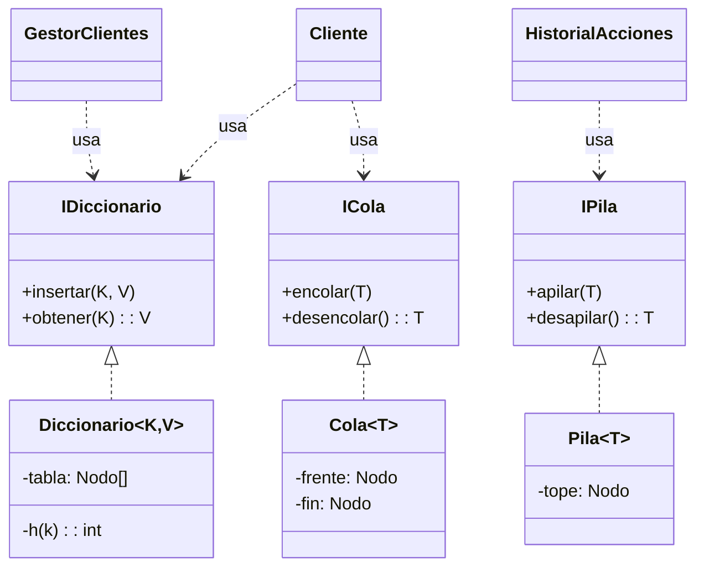

# Especificación de Tipos de Datos Abstractos (TDAs)

Este documento ofrece un análisis académico y técnico sobre la selección, implementación y aplicación de las estructuras de datos fundamentales en el sistema, justificando su idoneidad para resolver los desafíos de rendimiento y modelado del dominio.

---

## 1. Resumen de Complejidad Computacional

Se ha diseñado el sistema priorizando un límite superior asintótico de **O(1)** para las operaciones críticas, asegurando escalabilidad independiente del volumen de datos (N=1,000,000).

| Estructura | Interfaz | Implementación Concreta | Big O (Acceso) | Big O (Inserción) | Big O (Eliminación) | Rol Arquitectónico |
| :--- | :--- | :--- | :--- | :--- | :--- | :--- |
| **Diccionario** | `IDiccionario<K,V>` | *Hash Table (Separate Chaining)* | O(1)* | O(1)* | O(1)* | Motor de búsqueda e indexación primaria. |
| **Pila** | `IPila<T>` | *Linked List (LIFO)* | O(1) | O(1) | O(1) | Gestión de estados temporales (Historial). |
| **Cola** | `ICola<T>` | *Linked List (FIFO)* | O(1) | O(1) | O(1) | Buffer de procesamiento secuencial. |
| **Conjunto** | `IConjunto` | *Hash Set Adapter* | O(1)* | O(1)* | O(1)* | Validación de unicidad. |

*\* Amortizado promedio, asumiendo Función Hash uniforme y factor de carga controlado.*

---

## 2. Diccionario (Hash Table)

### 2.1. Fundamentación Teórica
El **Diccionario** es la columna vertebral del sistema. Se seleccionó una **Tabla Hash con Encadenamiento Separado (Separate Chaining)** frente a otras alternativas como Árboles Binarios de Búsqueda (BST) o Árboles AVL.
*   **Hash Table vs. BST**: Mientras que un BST ofrece operaciones en O(log n), una Tabla Hash bien dimensionada reduce esto a **O(1)**. Dado el requerimiento de manejar 1 millón de registros, la diferencia entre O(1) y O(log 10^6) ≈ 20 operaciones es significativa en latencia agregada.
*   **Encadenamiento vs. Direccionamiento Abierto**: Se eligió encadenamiento (listas enlazadas en buckets) porque degrada más suavemente ante factores de carga altos sin requerir rehashing costoso ni sufrir de *clustering* primario.

### 2.2. Implementación en Java
La clase `Diccionario<K, V>` implementa una tabla hash genérica manual (sin usar `java.util.HashMap`).

*   **Estructura Interna**: `NodoDiccionario<K, V>[] tabla`.
*   **Función Hash**: `h(k) = Math.abs(k.hashCode()) % M`, donde `M` es la capacidad.
*   **Manejo de Colisiones**: Inserción al inicio de la lista enlazada del bucket correspondiente.

### 2.3. Aplicación y Optimización Específica (Binding)
El sistema instancia esta estructura de dos formas críticas:

#### A. Repositorio de Clientes (`GestorClientes`)
*   **Instancia**: `Diccionario<Integer, Cliente> clientes`.
*   **Optimización de Memoria/Tiempo**: Se inicializa con una capacidad de **M = 1,000,003** (número primo).
    *   **Justificación**: Al tener M > N (1.000.003 > 1.000.000), el factor de carga α ≈ 1. Esto minimiza drásticamente las colisiones, acercando el rendimiento al mejor caso teórico de O(1) absoluto.
    *   **Impacto**: Buscar un usuario por ID es instantáneo, crucial para el login y la navegación.

#### B. Grafo de Relaciones (`Cliente`)
*   **Instancia**: `Diccionario<Integer, Boolean> siguiendo`.
*   **Uso**: Representa las aristas salientes del grafo social.
*   **Ventaja**: Permite verificar si "Usuario A sigue a Usuario B" (`sigueA(id)`) en **O(1)**. Una implementación con listas simples requeriría O(N), lo cual sería inviable.

---

## 3. Pila (Stack)

### 3.1. Fundamentación Teórica
La **Pila** es una estructura LIFO (Last In, First Out) ideal para problemas que requieren backtracking o reversión de estados.

### 3.2. Implementación en Java
La clase `Pila<T>` utiliza una lista enlazada simple, manteniendo únicamente una referencia al nodo `tope`.
*   **Eficiencia**: No requiere desplazamiento de elementos (como en un ArrayStack), por lo que `push` y `pop` son siempre O(1) reales, sin amortización.

### 3.3. Aplicación en el Sistema: Patrón Command
*   **Contexto**: Funcionalidad de "Deshacer" (Undo).
*   **Instancia**: `Pila<Accion> historial` dentro de `HistorialAcciones` (en `Sesion`).
*   **Mecánica**:
    1.  Cada operación reversible (Seguir, Dejar de Seguir) crea un objeto `Accion` (Command) que encapsula los datos necesarios para revertirla.
    2.  Esta acción se apila (`push`) en el historial.
    3.  Al solicitar "Deshacer", se desapila (`pop`) la última acción y se ejecuta su lógica inversa.
*   **Justificación**: La naturaleza LIFO de la Pila garantiza que las acciones se reversen en el orden cronológico inverso exacto, preservando la consistencia del estado.

---

## 4. Cola (Queue)

### 4.1. Fundamentación Teórica
La **Cola** es una estructura FIFO (First In, First Out) esencial para gestionar flujos de trabajo asincrónicos o bufferizados donde el orden de llegada determina la prioridad de atención (Fairness).

### 4.2. Implementación en Java
La clase `Cola<T>` emplea una lista enlazada con doble puntero:
*   `frente`: Para eliminaciones (desencolar) en O(1).
*   `fin`: Para inserciones (encolar) en O(1).
*   **Nota**: Implementar esto con un solo puntero o con un arreglo dinámico (sin implementacion circular) implicaría operaciones O(N) indeseables.

### 4.3. Aplicación en el Sistema: Gestión de Solicitudes
*   **Contexto**: Recepción de solicitudes de seguimiento.
*   **Instancia**: `Cola<SolicitudSeguimiento> solicitudesPendientes` dentro de cada `Cliente`.
*   **Flujo**:
    1.  Usuario A envía solicitud a B -> `colaB.encolar(solicitud)`.
    2.  Usuario B revisa sus pendientes -> `colaB.verFrente()`.
    3.  Usuario B acepta/rechaza -> `colaB.desencolar()`.
*   **Valor Académico**: Garantiza la **equidad** en el procesamiento. La primera persona que solicitó seguirte es la primera que verás.

---

## 5. Conjunto (Set)

### 5.1. Fundamentación Teórica
El **Conjunto** modela la abstracción matemática de una colección de elementos únicos, abstrayendo el orden.

### 5.2. Implementación en Java (Adapter Pattern)
La clase `Conjunto` se implementa como un **Adapter** sobre el `Diccionario`.
*   **Mecanismo**: Almacena el elemento como *clave* y un valor dummy (`true`) como *valor*.
*   **Reuso**: Aprovecha toda la lógica de resolución de colisiones y hashing del Diccionario, evitando duplicación de código compleja.

---

## 6. Abstracción y Diseño Orientado a Objetos

El sistema demuestra madurez en ingeniería de software mediante el uso estricto de **Interfaces y Genéricos**.

### 6.1. Principio de Inversión de Dependencias (DIP)
Las clases de alto nivel (`GestorClientes`, `Sesion`) no dependen de implementaciones concretas, sino de interfaces:
*   `IDiccionario<K,V>`
*   `IPila<T>`
*   `ICola<T>`

Esto permite, por ejemplo, cambiar la implementación de `Pila` de una lista enlazada a un arreglo dinámico sin modificar una sola línea de `HistorialAcciones`.

### 6.2. Genéricos (Generics)
El uso de `<T>`, `<K, V>` permite un **Polimorfismo Paramétrico**. Una única clase `Diccionario` sirve tanto para indexar Clientes por ID (`<Integer, Cliente>`) como para verificar seguidos (`<Integer, Boolean>`), garantizando **Type Safety** en tiempo de compilación y eliminando castigos excesivos.

---

## 7. Diagrama Conceptual de Estructuras

## 8. Conclusión

La selección de estructuras no es accidental, sino el resultado de un análisis de los requisitos no funcionales del sistema:
1.  **Diccionario O(1)**: Necesario por el volumen de 1M de usuarios.
2.  **Pila LIFO**: Necesaria por la lógica de reversión temporal (Undo).
3.  **Cola FIFO**: Necesaria por la lógica de equidad temporal (Solicitudes).

Esta arquitectura de datos híbrida permite que el sistema sea **rápido (latencia baja)** y **funcionalmente robusto**, cumpliendo con los estándares académicos de un diseño eficiente.
