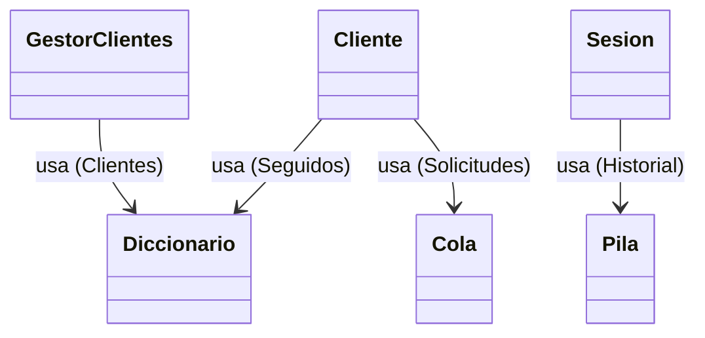

# Especificación de Tipos de Datos Abstractos (TDAs)

Este documento justifica técnica y teóricamente la elección de las estructuras de datos, detallando su implementación, complejidad asintótica y aplicación en el dominio del problema.

---

## 1. Resumen de Complejidad

Se ha priorizado un límite superior asintótico de **O(1)** para las operaciones más frecuentes del sistema.

| Estructura | Implementación | Acceso | Inserción | Eliminación | Uso Principal |
| :--- | :--- | :--- | :--- | :--- | :--- |
| **Diccionario** | Hash Table (Addressable) | O(1)* | O(1)* | O(1)* | Indexación de usuarios y relaciones. |
| **Pila** | Linked List (LIFO) | O(1) | O(1) | O(1) | Gestión del historial (Undo/Redo). |
| **Cola** | Linked List (FIFO) | O(1) | O(1) | O(1) | Buffer de solicitudes de seguimiento. |
| **Conjunto** | Hash Set Adapter | O(1)* | O(1)* | O(1)* | Verificación de unicidad. |

*\* Amortizado promedio.*

---

## 2. Diccionario (Hash Table)

### 2.1. Definición
Estructura asociativa que almacena pares clave-valor, permitiendo la recuperación eficiente de valores a partir de su clave única.

### 2.2. Implementación Técnica
*   **Estrategia**: Open Hashing (Encadenamiento separado).
*   **Función Hash**: Modular aritmética (`Math.abs(key.hashCode() % CAPACIDAD)`).
*   **Capacidad**: 64 buckets (Fija, sin rehashing dinámico por diseño para simplificar la gestión de memoria en este prototipo).
*   **Colisiones**: Resueltas mediante listas enlazadas simples en cada bucket.

### 2.3. Análisis de Complejidad
*   **Caso Promedio**: O(1), asumiendo una distribución uniforme de claves.
*   **Peor Caso**: O(n), degenerando en una lista enlazada si todas las claves colisionan.

### 2.4. Aplicación en el Sistema
*   **Gestión de Usuarios**: `GestorClientes` utiliza un Diccionario para mapear `ID (Integer)` -> `Cliente (Objeto)`.
*   **Relaciones**: Cada `Cliente` mantiene un Diccionario de usuarios seguidos para verificar relaciones en tiempo constante.

---

## 3. Pila (Stack)

### 3.1. Definición
Colección lineal que sigue la política **LIFO** (Last In, First Out).

### 3.2. Implementación Técnica
*   **Estructura**: Lista enlazada simple.
*   **Punteros**: Referencia única al nodo `tope`.

### 3.3. Análisis de Complejidad
Todas las operaciones primitivas (`push`, `pop`, `peek`) manipulan únicamente el puntero al tope, garantizando una complejidad temporal constante **O(1)** independiente del tamaño de la pila.

### 3.4. Aplicación en el Sistema
Se utiliza implementar el patrón **Command** para la funcionalidad de deshacer/rehacer:
1.  **Historial**: Pila de acciones realizadas.
2.  **Redo**: Pila de acciones revertidas.

---

## 4. Cola (Queue)

### 4.1. Definición
Colección lineal que sigue la política **FIFO** (First In, First Out).

### 4.2. Implementación Técnica
*   **Estructura**: Lista enlazada simple.
*   **Punteros**: Referencias explícitas a `frente` (inicio) y `fin` (final) para permitir inserciones y eliminaciones en extremos opuestos sin recorrer la estructura.

### 4.3. Análisis de Complejidad
*   **Encolar**: Inserción al final usando el puntero `fin` → **O(1)**.
*   **Desencolar**: Eliminación del frente usando el puntero `frente` → **O(1)**.

### 4.4. Aplicación en el Sistema
Gestiona las solicitudes de seguimiento asincrónicas. Garantiza la equidad en el procesamiento: la primera solicitud recibida es la primera en ser presentada al usuario.

---

## 5. Abstracción y Polimorfismo

El sistema adhiere al **Principio de Inversión de Dependencias (DIP)** mediante la definición de interfaces estrictas para cada TDA:

*   `IDiccionario<K,V>`
*   `IPila<T>`
*   `ICola<T>`

Esto desacopla la implementación concreta (listas enlazadas, arreglos, etc.) de los clientes que consumen estas estructuras (Gestores, Modelos), permitiendo la sustitución de implementaciones sin impacto en la lógica de negocio.

---

## 6. Diagrama de Estructuras

A continuación se esquematiza la jerarquía y composición de los TDAs en el modelo de objetos:

## 7. Conclusión

La selección de estas estructuras de datos específicas permite cumplir con los requisitos no funcionales de rendimiento, proporcionando tiempos de respuesta inmediatos incluso bajo carga simulada de 1.000.000 de registros.
